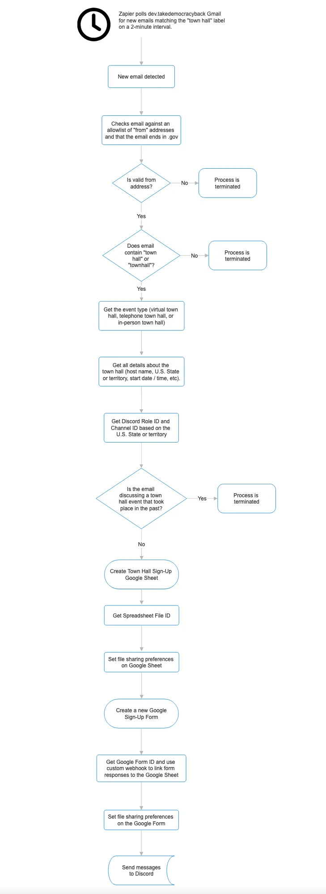

# Town Hall Curator

An application to create town hall events for legislators in a single location

## project Setup

This project uses `pnpm` as the package manager. The project is configured as a monorepo using a PNPM Workspace. 

Instructions on how to install [`pnpm` can be found here](https://pnpm.io/installation).

## Project Structure

All application code lives in the `/apps` directory. To install dependencies for each application, run `pnpm install` at the root of the project.

### The `/apps` Directory

The `/apps` directory contains the source code for several applications. As it currently stands, the app directory contains the following structure:

- `/apps`
 - `/core`
 - `/lambdas`
 - `/server`
 - `/ui`

The `/core` directory contains the business logic to facilitate 

## Project Plan
